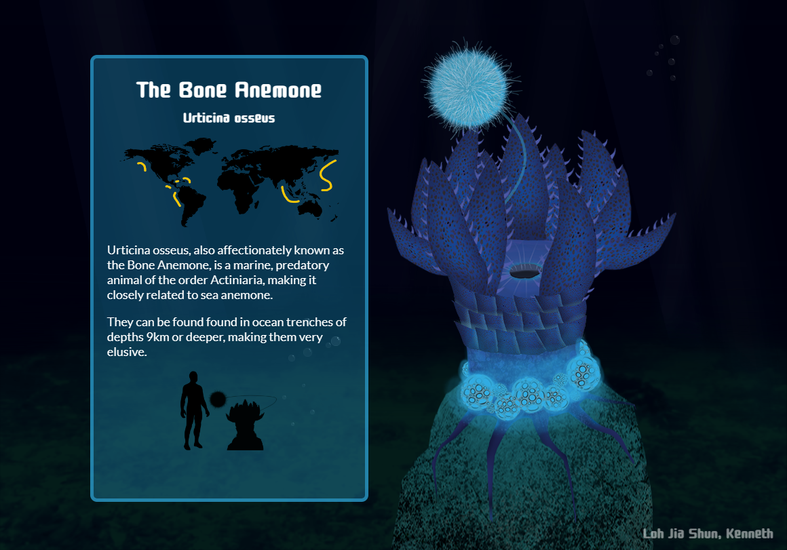

# The Bone Anemone

*Project completed in March 2019*

-----

The final project in the ID2115 module (Digital Sketching and Painting) was to create a fictional plant through silhouette sketching. After that, we had to render (drawing and painting, not computer graphics) the plant in its natural habitat, along with descriptions of its various anatomy.

I decided to have some fun with it so I redrew the anatomical parts on separate layers and animated them with CSS animations. Hovering over its various anatomy also shows a detailed description of how the part functions as part of the plant.

You can view the demo [here](https://kenneth-ljs.github.io/bone-anemone-showcase)